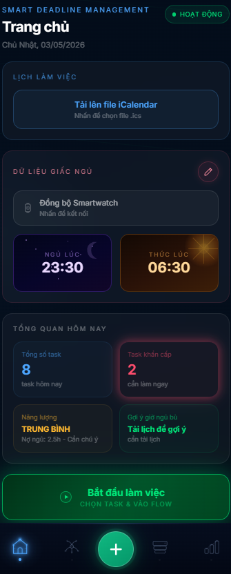

# 🧠 Smart Deadline Management

> **Hệ thống quản lý deadline thông minh dành cho sinh viên** — tích hợp AI phân tích độ khó, đo năng lượng theo Nợ ngủ và tự động sắp xếp ưu tiên công việc.



---

## 📋 Thông tin Đồ án

| Thông tin | Chi tiết |
|-----------|----------|
| **Trường** | Đại học Công nghệ Thông tin — ĐHQG.HCM |
| **Lớp** | SS004.Q24 |
| **Nhóm** | Nhóm 11 |

---

## 🚀 Tính năng chính

### 1. 📊 Bảng Tổng Quan AI (Overview Dashboard)
- Hiển thị tổng số task trong ngày
- Cảnh báo task khẩn cấp (deadline gần)
- Mức độ năng lượng: **Cao / Trung Bình / Cạn Kiệt** dựa trên Nợ ngủ
- Gợi ý giờ ngủ bù từ lịch học

### 2. 🐸 Chọn Task Khó Nhất Trước Tiên (Eat the Frog)
- AI tự động phân tích trọng số độ khó (Đơn giản / Dài hạn / Phức tạp)
- Hiển thị danh sách task được sắp xếp theo **Độ khó × Deadline**
- Không thể bỏ qua task khó bằng cách làm hàng chục task nhỏ lẻ

### 3. 🧮 Trung Tâm Điều Phối (Neural Matrix)
- Ma trận Eisenhower 4 ô: **Ưu tiên 1, 2, 3, 4**
- Thuật toán **Relative Urgency** với hàm phạt điểm số mũ:
  ```
  urgency_score = math.pow(2, panic_threshold - time_left_days)
  ```
- Hiển thị Điểm Tập Trung (%) = `100 - (Nợ ngủ × 5)`
- Dự báo Đỉnh Tập Trung (Peak Focus Hour) từ lịch sử làm việc

### 4. ⏱️ Flow State (Kích Hoạt Tập Trung)
- Chế độ **Flowtime** (không giới hạn thời gian)
- Chế độ **Pomodoro** (25 phút tập trung / 5 phút nghỉ)
- Ghi nhận hiệu suất ngay khi hoàn thành task

### 5. 📈 Thống Kê Kết Phiên (All Done)
- **Hiệu suất trọng số**: Task phức tạp (3đ) > task đơn giản (1đ)
- Tổng thời gian Flow Time thực tế
- Tự động đề xuất 3 task ngày hôm sau (Task Injection)

---

## 🛠️ Công nghệ sử dụng

### Frontend
| Công nghệ | Phiên bản | Mô tả |
|-----------|-----------|-------|
| React | 18.3.1 | UI Framework |
| TypeScript | — | Type-safe JavaScript |
| Vite | 6.3.5 | Build tool |
| Tailwind CSS | 4.1.12 | Styling |
| React Router | 7.13.0 | Client-side routing |
| Recharts | 2.15.2 | Biểu đồ thống kê |
| Motion | 12.23.24 | Animation |

### Backend
| Công nghệ | Mô tả |
|-----------|-------|
| Python 3.x | Ngôn ngữ chính |
| FastAPI | REST API framework |
| Uvicorn | ASGI server |
| Google Gemini AI | Phân tích và gợi ý |
| iCalendar | Đọc file lịch học `.ics` |

### Landing Page
- HTML5 thuần + Tailwind CSS CDN (standalone, không phụ thuộc App)

---

## ⚙️ Cài đặt và Chạy

### Yêu cầu
- **Node.js** ≥ 18
- **Python** ≥ 3.10
- **npm** hoặc **pnpm**

### 1. Clone repository
```bash
git clone https://github.com/<your-username>/smart-deadline-management.git
cd smart-deadline-management
```

### 2. Cài đặt Frontend
```bash
npm install
```

### 3. Cài đặt Backend
```bash
cd backend
pip install -r requirements.txt
cd ..
```

### 4. Cấu hình môi trường
Tạo file `backend/.env`:
```env
GEMINI_API_KEY=your_google_gemini_api_key_here
```

### 5. Chạy ứng dụng (Frontend + Backend cùng lúc)
```bash
npm run dev
```

Ứng dụng sẽ chạy tại:
- **Frontend:** http://localhost:5173
- **Backend API:** http://localhost:8000

---

## 📁 Cấu trúc thư mục

```
smart-deadline-management/
├── src/                    # Frontend React
│   ├── app/
│   │   ├── screens/        # Các màn hình chính
│   │   ├── context/        # AppContext (state management)
│   │   └── routes.tsx      # Định tuyến
│   └── main.tsx
├── backend/                # Backend FastAPI
│   ├── app/
│   │   ├── services/       # Logic xử lý (task engine, AI)
│   │   └── main.py
│   └── requirements.txt
├── LandingPage/            # Trang giới thiệu (standalone)
│   ├── index.html
│   └── images/
└── README.md
```

## 📐 Thuật toán cốt lõi

### Dynamic Panic Threshold (Relative Urgency)
```python
def calculate_priority(task, all_tasks):
    # Tìm deadline gần nhất trong tất cả task
    min_deadline = min(t.deadline for t in all_tasks)
    panic_threshold = (min_deadline - now).days

    # Hàm phạt số mũ
    time_left = (task.deadline - now).days
    urgency_score = math.pow(2, panic_threshold - time_left)

    return urgency_score * task.importance
```

### Weighted Efficiency (Hiệu suất trọng số)
```
Efficiency (%) = Σ(completed_tasks × difficulty_weight) / Σ(all_tasks × difficulty_weight) × 100

Difficulty weights:
  - Đơn giản  → 1 điểm
  - Dài hạn   → 2 điểm  
  - Phức tạp  → 3 điểm
```

### Focus Score (Điểm tập trung)
```
Focus Score (%) = 100 - (Sleep Debt × 5)
Min: 0% | Max: 100%
```
